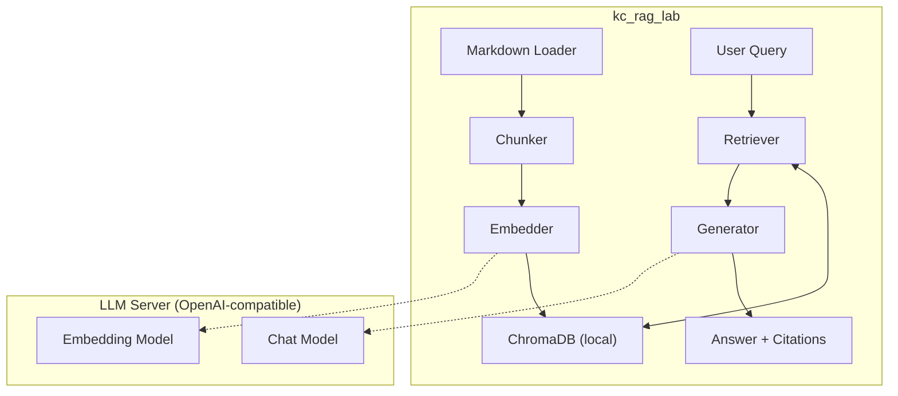

# Build Your Own RAG Pipeline From Scratch

[](LICENSE)
[](https://www.python.org/)
[](https://github.com/KerberosClaw/kc_rag_lab/actions/workflows/test.yml)

[正體中文](README_zh.md)

Everyone talks about RAG. Most people `pip install langchain` and call it a day. We built every stage by hand — loader, chunker, embedder, vector store, retriever, generator — because the only way to really understand RAG is to mass-debug every stage yourself.

No LangChain. No LlamaIndex. No paid APIs. Just you, your Markdown files, and a local LLM that has been specifically instructed to say "I don't know" when it doesn't know. Radical concept, we know.

---

> **Security Notice:** This is a learning/development project designed for local use. The LLM API connection uses HTTP by default (localhost only), the Gradio Web UI has no authentication, and error messages from the LLM server are displayed verbatim. Do not expose service ports to the public internet without additional security measures.

## Architecture



## What Each Stage Actually Does

| Stage | Module | The Job |
|-------|--------|---------|
| 1 | `loader.py` | Recursively scan directories, read `.md` files, strip that YAML frontmatter nobody asked for |
| 2 | `chunker.py` | Split by Markdown headings — because cutting text at exactly 500 characters is how you get answers split in ha |
| 3 | `embedder.py` | Turn text into 1024-dimensional math that somehow captures "meaning" — batch mode, because we're not animals |
| 4 | `store.py` | Shove all those vectors into ChromaDB and hope cosine similarity knows what it's doing |
| 5 | `retriever.py` | "Find me the 5 chunks most related to this question" — the part that makes or breaks the whole thing |
| 6 | `generator.py` | Feed the LLM your question + retrieved context, explicitly tell it not to make stuff up. It mostly listens. |

## Quick Start

### You'll Need

- Python 3.12+
- [uv](https://github.com/astral-sh/uv) (or pip, but we both know uv is faster)
- A local LLM server that speaks OpenAI — [oMLX](https://github.com/jundot/omlx), [Ollama](https://ollama.com/), or just the actual OpenAI API if you've got money to burn
- An embedding model (BGE-M3, nomic-embed-text, text-embedding-3-small)
- A chat model (Qwen3, Llama, GPT-4o — dealer's choice)

### Setup

```bash
git clone https://github.com/KerberosClaw/kc_rag_lab.git
cd kc_rag_lab

# Configure your LLM server
cp .env.example .env
# Edit .env with your server URL, API key, and model names

# Install dependencies
uv sync
```

### The Four Commands You Actually Need

```bash
# 1. Ingest your Markdown docs
uv run python -m src.pipeline ingest ./sample_docs/

# 2. Ask a question
uv run python -m src.pipeline ask "What is RAG?"

# 3. Interactive chat mode
uv run python -m src.pipeline chat

# 4. Web UI (Gradio) — for when you want to feel fancy
uv run python -m src.pipeline ui
```

### What It Looks Like

```
Question: What is RAG?

Answer: RAG (Retrieval-Augmented Generation) is a technique that lets LLMs
search your documents before answering, using retrieved content as reference
material instead of relying solely on training knowledge...

Sources:
| # | File              | Section         | Score |
|---|-------------------|-----------------|-------|
| 1 | rag-overview.md   | What is RAG?    | 0.892 |
| 2 | chunking.md       | Why chunk?      | 0.654 |
```

It even tells you where it got the answer. Trust but verify.

## Bring Your Own LLM

Anything that speaks `/v1/embeddings` + `/v1/chat/completions`:

| Server | Embedding Model | Chat Model | Notes |
|--------|----------------|------------|-------|
| [oMLX](https://github.com/jundot/omlx) | BGE-M3 | Qwen3-VL | Native macOS, Apple Silicon optimized |
| [Ollama](https://ollama.com/) | nomic-embed-text | qwen3, llama3 | Cross-platform, easiest setup |
| OpenAI API | text-embedding-3-small | gpt-4o | Best quality, costs actual money |

Switching servers is literally just changing environment variables. No code touched. We designed it that way on purpose — because we knew we'd be switching servers constantly.

## Project Structure

```
kc_rag_lab/
├── src/
│   ├── loader.py        # Stage 1: Markdown document loading
│   ├── chunker.py       # Stage 2: Heading-based chunking
│   ├── embedder.py      # Stage 3: OpenAI-compatible embedding
│   ├── store.py         # Stage 4: ChromaDB vector storage
│   ├── retriever.py     # Stage 5: Similarity search
│   ├── generator.py     # Stage 6: Grounded answer generation
│   ├── pipeline.py      # CLI entry point
│   ├── webui.py         # Gradio web interface
│   └── config.py        # Configuration and data models
├── tests/               # Unit + integration tests
├── specs/               # Spec-driven development artifacts
├── sample_docs/         # Sample Markdown docs to try
├── docs/
│   └── DESIGN.md        # Detailed design document
├── .github/workflows/   # CI pipeline
├── .env.example         # Environment variable template
└── pyproject.toml
```

## Design Decisions (a.k.a. Lessons Learned the Hard Way)

- **No frameworks** — we hand-built every stage because "just use LangChain" teaches you exactly nothing about how RAG actually works
- **OpenAI-compatible API** — swap embedding and chat models by changing env vars, not code. We learned this after rewriting the API client for the third time
- **Heading-based chunking** — Markdown has natural structure, so we use it. Cutting text at fixed character counts is how you get "the answer to your question is" in one chunk and "yes" in the next
- **ChromaDB** — zero-config, pure Python, stores to local files. Perfect for learning. Not perfect for a million documents, but that's a problem for future-us
- **Low temperature (0.1)** — we specifically told the LLM to be boring. Creative writing is for poets, not knowledge bases
- **Explicit refusal** — when the LLM doesn't know, it says "I don't know." Revolutionary, apparently

See [docs/DESIGN.md](docs/DESIGN.md) for the full war story.

## License

MIT
