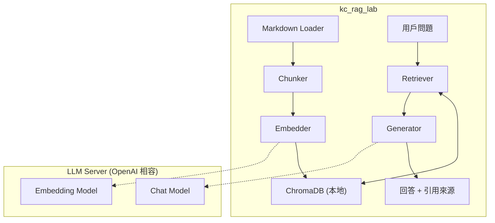

# 從零手刻一條 RAG Pipeline

[](LICENSE)
[](https://www.python.org/)
[](https://github.com/KerberosClaw/kc_rag_lab/actions/workflows/test.yml)

[English](README.md)

大家都在講 RAG。大部分人 `pip install langchain` 然後收工。我們把每一步都自己寫 — loader、chunker、embedder、vector store、retriever、generator — 因為真正搞懂 RAG 的唯一方法，就是親手把每個環節的坑都踩一遍。

不用 LangChain。不用 LlamaIndex。不花 API 錢。就你、你的 Markdown 檔案、還有一個被我們明確教導「不知道就說不知道」的本地 LLM。聽起來很基本，但你知道這有多難嗎。

---

> **安全聲明：** 本專案為學習/開發用途，設計用於本地環境。LLM API 連線預設使用 HTTP（僅 localhost），Gradio Web UI 不包含認證機制，LLM server 的錯誤訊息會直接顯示。請勿在未加裝額外安全措施的情況下將服務埠暴露到公網。

## 架構



## 每個階段到底在幹嘛

| 階段 | 模組 | 工作內容 |
|------|------|---------|
| 1 | `loader.py` | 遞迴掃資料夾、讀 `.md` 檔、順便把沒人要看的 YAML frontmatter 幹掉 |
| 2 | `chunker.py` | 按 Markdown heading 切塊 — 因為在第 500 個字硬切，你就會得到一半的答案 |
| 3 | `embedder.py` | 把文字變成 1024 維的數學向量，然後宣稱這堆數字可以代表「語意」— 批次處理，因為一個一個送太蠢了 |
| 4 | `store.py` | 把所有向量塞進 ChromaDB，然後相信 cosine similarity 知道自己在幹嘛 |
| 5 | `retriever.py` | 「找出跟這個問題最相關的 5 個 chunk」— 整個 pipeline 成敗就在這一步 |
| 6 | `generator.py` | 把問題 + 搜出來的 context 餵給 LLM，然後嚴格規定它不准亂掰。它大部分時候有聽話。 |

## 快速開始

### 你需要

- Python 3.12+
- [uv](https://github.com/astral-sh/uv)（或 pip，但我們都知道 uv 比較快）
- 一台會講 OpenAI 語言的本地 LLM server — [oMLX](https://github.com/jundot/omlx)、[Ollama](https://ollama.com/)、或是直接用 OpenAI API（如果你有錢燒的話）
- Embedding model（BGE-M3、nomic-embed-text、text-embedding-3-small）
- Chat model（Qwen3、Llama、GPT-4o — 看你高興）

### 安裝

```bash
git clone https://github.com/KerberosClaw/kc_rag_lab.git
cd kc_rag_lab

# 設定 LLM server
cp .env.example .env
# 編輯 .env，填入你的 server URL、API key、model 名稱

# 安裝依賴
uv sync
```

### 你真正需要的四個指令

```bash
# 1. 匯入 Markdown 文件
uv run python -m src.pipeline ingest ./sample_docs/

# 2. 問問題
uv run python -m src.pipeline ask "什麼是 RAG？"

# 3. 互動問答模式
uv run python -m src.pipeline chat

# 4. Web UI（Gradio）— 想耍帥的時候用
uv run python -m src.pipeline ui
```

### 跑起來長這樣

```
Question: What is RAG?

Answer: RAG (Retrieval-Augmented Generation) is a technique that lets LLMs
search your documents before answering, using retrieved content as reference
material instead of relying solely on training knowledge...

Sources:
| # | File              | Section         | Score |
|---|-------------------|-----------------|-------|
| 1 | rag-overview.md   | What is RAG?    | 0.892 |
| 2 | chunking.md       | Why chunk?      | 0.654 |
```

它還會告訴你答案是從哪裡來的。信任，但要驗證。

## 帶你自己的 LLM

只要會講 `/v1/embeddings` + `/v1/chat/completions` 的都行：

| Server | Embedding Model | Chat Model | 備註 |
|--------|----------------|------------|------|
| [oMLX](https://github.com/jundot/omlx) | BGE-M3 | Qwen3-VL | macOS 原生、Apple Silicon 優化 |
| [Ollama](https://ollama.com/) | nomic-embed-text | qwen3, llama3 | 跨平台、最容易裝 |
| OpenAI API | text-embedding-3-small | gpt-4o | 效果最好、要花真的錢 |

切換 server 就是改環境變數。不用改 code。我們刻意這樣設計的 — 因為我們知道自己會一直換 server。

## 專案結構

```
kc_rag_lab/
├── src/
│   ├── loader.py        # Stage 1: Markdown 文件載入
│   ├── chunker.py       # Stage 2: Heading 切塊
│   ├── embedder.py      # Stage 3: OpenAI 相容 embedding
│   ├── store.py         # Stage 4: ChromaDB 向量存儲
│   ├── retriever.py     # Stage 5: 相似度搜尋
│   ├── generator.py     # Stage 6: 根據檢索結果生成回答
│   ├── pipeline.py      # CLI 入口
│   ├── webui.py         # Gradio Web 介面
│   └── config.py        # 設定與資料結構
├── tests/               # 單元測試 + 整合測試
├── specs/               # Spec-driven 開發文件
├── sample_docs/         # 範例 Markdown 文件
├── docs/
│   └── DESIGN.md        # 詳細設計文件
├── .github/workflows/   # CI pipeline
├── .env.example         # 環境變數範本
└── pyproject.toml
```

## 設計決策（又叫被現實教訓出來的決策）

- **不用框架** — 我們手刻每一步，因為「用 LangChain 就好了」只會讓你學到怎麼用 LangChain，不會讓你學到 RAG 到底怎麼運作
- **OpenAI 相容 API** — 換 embedding 和 chat model 改環境變數就好，不用改 code。這是我們第三次重寫 API client 之後學到的教訓
- **按 Heading 切塊** — Markdown 有天然結構，我們就用它。按固定字數硬切的結果就是「這個問題的答案是」在一個 chunk，「是的」在下一個 chunk
- **ChromaDB** — 零設定、純 Python、存本地檔案。學習用完美。一百萬筆資料？那是未來的我們的問題
- **低 Temperature (0.1)** — 我們特別要求 LLM 無聊一點。創意寫作是詩人的事，不是知識庫的事
- **明確拒答** — LLM 不知道的時候就說「我不知道」。這在 2026 年居然還是個賣點

詳細踩坑紀錄見 [docs/DESIGN.md](docs/DESIGN.md)。

## License

MIT
