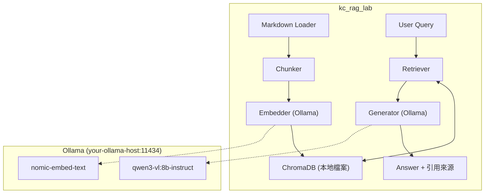

# kc_rag_lab -- Design Document

> **English summary:** A local-first RAG (Retrieval-Augmented Generation) pipeline that ingests Markdown documents, chunks them, generates embeddings via Ollama, stores vectors in ChromaDB, and answers questions grounded in retrieved context — with the ability to say "I don't know" when no relevant information is found. Built as a hands-on learning project to understand every stage of the RAG pipeline without relying on paid APIs.

---

# 設計文件

## 概觀

一個全本地的 RAG pipeline 練習專案。把一堆 Markdown 文件吃進去、切塊、轉向量、存起來，然後你問問題，它去搜最相關的片段，餵給本地 LLM 回答。沒有相關資料就老實說「不知道」，不幻覺。

不用 OpenAI、不花錢、不上雲。全部跑在本地 Ollama 上。

### 解決什麼問題？

企業 RAG 的核心場景：員工問問題，系統從內部文件找答案。聽起來簡單，但魔鬼在細節：

- 文件怎麼切？切太大浪費 token，切太小丟失上下文，切到一半把答案切斷
- 搜出來的片段真的相關嗎？還是只是剛好有幾個關鍵字重疊？
- LLM 真的只看你給的資料回答嗎？還是偷偷用自己的訓練知識在掰？

這個專案的目的就是把每一步拆開來做，搞清楚每個環節的影響。

### 為什麼全本地？

1. 不想花錢在 API 上，概念搞懂了到公司再套 OpenAI
2. 本地跑可以隨便實驗，不怕燒 token
3. 順便搞清楚本地模型在 RAG 場景的能力邊界

---

## 架構



---

## Pipeline 各階段設計

### Stage 1: Document Loader

**輸入：** 一個資料夾路徑，裡面都是 `.md` 檔

**輸出：** 文件列表，每份包含內容 + metadata（檔名、路徑）

- 遞迴掃描目標資料夾
- 只處理 Markdown，其他格式先不管
- 保留檔名作為 metadata，之後回答時可以引用來源

### Stage 2: Chunker（切塊）

**輸入：** 一份完整文件

**輸出：** 多個 chunk，每個帶 metadata

**策略：**

- **基礎版：** 按 Markdown heading（`#`, `##`, `###`）切塊
  - 為什麼不用固定字數切？因為 Markdown 有天然結構，按標題切能保留語意完整性
  - 每個 chunk = 一個 section 的內容
  - 如果單一 section 超過 token 上限，再用固定長度 + overlap 切

- **Chunk 大小目標：** 200-500 字（中文），對應約 300-800 tokens
  - nomic-embed-text 上限 8192 tokens，不太會爆
  - 但太長的 chunk 會稀釋向量語意，搜出來不精準

- **Overlap：** section 內二次切割時，保留前後 50 字重疊，避免答案被切斷

- **Metadata：** 每個 chunk 記錄來源檔名、heading 層級、在原文的位置

### Stage 3: Embedder

**輸入：** chunk 文字

**輸出：** 768 維向量

- 使用 Ollama 的 `nomic-embed-text`
- 批次處理，不要一個一個送

### Stage 4: Vector Store

**使用 ChromaDB：**
- 純 Python，存本地檔案，零設定
- 支援 metadata filtering
- 內建 cosine similarity 搜尋

**Collection 設計：**
- 一個 collection 對應一組文件（例如 `rag_docs`）
- 可以重建（刪掉重來）或增量更新

### Stage 5: Retriever

**輸入：** 用戶問題

**輸出：** Top-K 個最相關的 chunk

**策略：**
- 用戶問題同樣走 nomic-embed-text 轉向量
- ChromaDB cosine similarity 搜尋
- 預設取 Top-5，可調整
- 回傳 chunk 內容 + similarity score + 來源 metadata

**進階（後續可加）：**
- 設 similarity 門檻，低於門檻的不要
- Reranking（用 LLM 對搜出來的結果再排一次序）

### Stage 6: Generator

**輸入：** 用戶問題 + 檢索到的 chunks

**輸出：** 回答 + 引用來源

**Prompt 模板：**

```
你是一個知識庫助手。根據以下提供的參考資料回答用戶的問題。

規則：
1. 只能根據參考資料的內容回答
2. 如果參考資料中沒有相關資訊，直接回答「根據現有資料，我無法回答這個問題」
3. 回答時標註引用來源（檔名）

參考資料：
{retrieved_chunks}

用戶問題：{query}
```

- 使用 `qwen3-vl:8b-instruct`（已驗證過 tool calling 穩定，問答應該更沒問題）
- Temperature 設低（0.1-0.3），減少創意發揮

---

## 專案結構

```
kc_rag_lab/
├── src/
│   ├── __init__.py
│   ├── loader.py        # Stage 1: Markdown 文件載入
│   ├── chunker.py       # Stage 2: 文件切塊
│   ├── embedder.py      # Stage 3: Ollama embedding
│   ├── store.py         # Stage 4: ChromaDB 向量存儲
│   ├── retriever.py     # Stage 5: 相似度搜尋
│   ├── generator.py     # Stage 6: LLM 回答生成
│   ├── pipeline.py      # 串接以上所有階段
│   └── config.py        # Ollama URL、模型名稱、chunk 參數等
├── tests/
│   └── ...
├── docs/
│   ├── DESIGN.md        # 本文件
│   └── images/
├── pyproject.toml
├── LICENSE
└── README.md
```

---

## 使用方式（目標）

```bash
# 1. 匯入文件
python -m src.pipeline ingest ./sample_docs/

# 2. 問問題
python -m src.pipeline ask "OpenClaw 的 Telegram bot 怎麼設定？"

# 3. 互動模式
python -m src.pipeline chat
```

---

## 技術選型理由

| 選擇 | 理由 |
|------|------|
| ChromaDB | 純 Python、零設定、本地檔案、夠用 |
| nomic-embed-text | 已有、768 維、中英文支援、8192 token 上限夠大 |
| qwen3-vl:8b-instruct | 已驗證穩定、16GB VRAM 跑得動、指令遵從度夠 |
| Markdown heading 切塊 | Markdown 文件有結構，比固定字數切更能保留語意 |
| 不用 LangChain | 手刻每一步才能搞懂原理，framework 會把細節藏起來 |

---

## 不做的事

- 不支援 PDF / Word / HTML（第一版只做 Markdown）
- 不做 Web UI（CLI 就好）
- 不做多用戶 / 權限控制
- 不做雲端部署
- 不用 LangChain / LlamaIndex（目的是學原理，不是用框架）

---

## 後續可擴展

- 加 similarity 門檻 + faithfulness 評估
- 支援更多文件格式
- 加 reranking 機制
- 換不同 embedding model / LLM 比較效果
- Web UI（Gradio 或 Streamlit）
